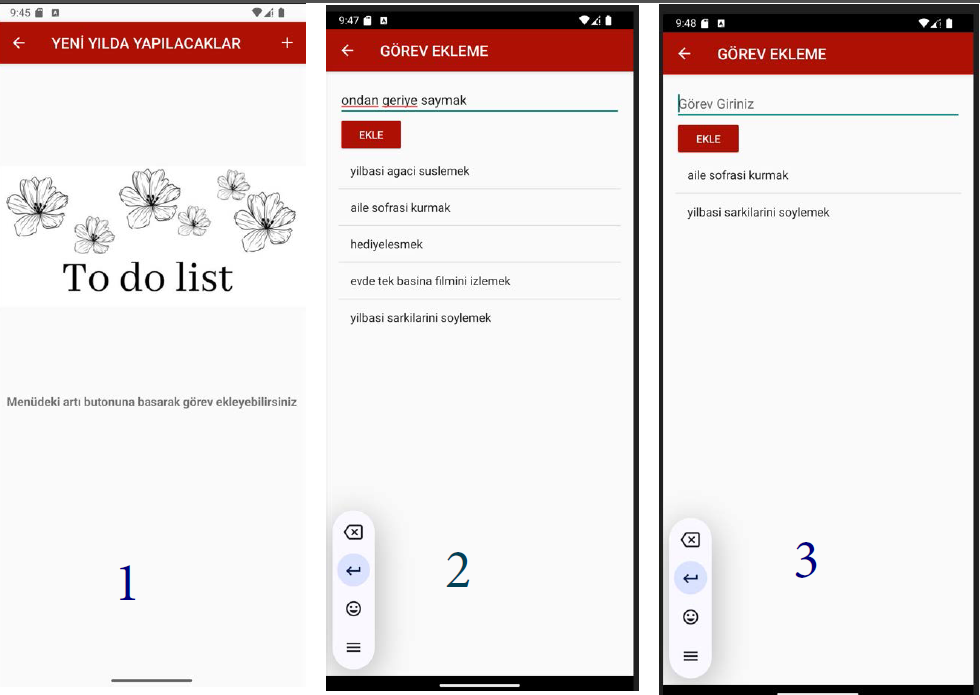

🎄 Christmas Countdown Android App
Bu proje, Android platformunda Java dili kullanılarak geliştirilmiştir. Uygulama; Yılbaşı Geri Sayımı, Advent Takvimi, ve Yapılacaklar Listesi olmak üzere üç ana modülden oluşmaktadır.

🛠️ Kullanılan Teknolojiler
Android Studio (LadyBug 1.2.2024): Geliştirme ortamı olarak kullanılmıştır.

Java: Uygulamanın temel programlama dilidir.

SQLite: Yapılacaklar listesi için yerel veritabanı çözümü kullanılmıştır.

XML: Arayüz tasarımları oluşturulmuştur.

📱 Uygulama Modülleri
MainActivity: Yılbaşı temalı karşılama ekranı ve diğer modüllere yönlendirme butonları içerir.

AdventCalenderActivity: 1–25 Aralık tarihleri arasında her gün açılabilen sürpriz hediyeler sunar.

DatabaseHelper: Görev ekleme, listeleme ve silme işlemlerini kolaylaştıran SQLite yardımcı sınıfıdır.

ToDoActivity: Kullanıcının görev eklemesini sağlayan menü destekli sade bir görev listesi ekranı sunar.

AddTaskActivity: Kullanıcıdan görev alıp listeye ekleyen ve görevler üzerinde düzenleme/silme işlemleri yapılmasını sağlayan ekrandır.

📋 Genel Özellikler
1 Ocak 2025 için geri sayım.

Gün gün açılan bir Advent takvimi.

Yapılacaklar listesi ile görev yönetimi.

Basit ve kullanıcı dostu arayüz tasarımı.
## 📷 Ekran Görüntüleri

### Ana Sayfa

### Yapılacaklar Listesi

